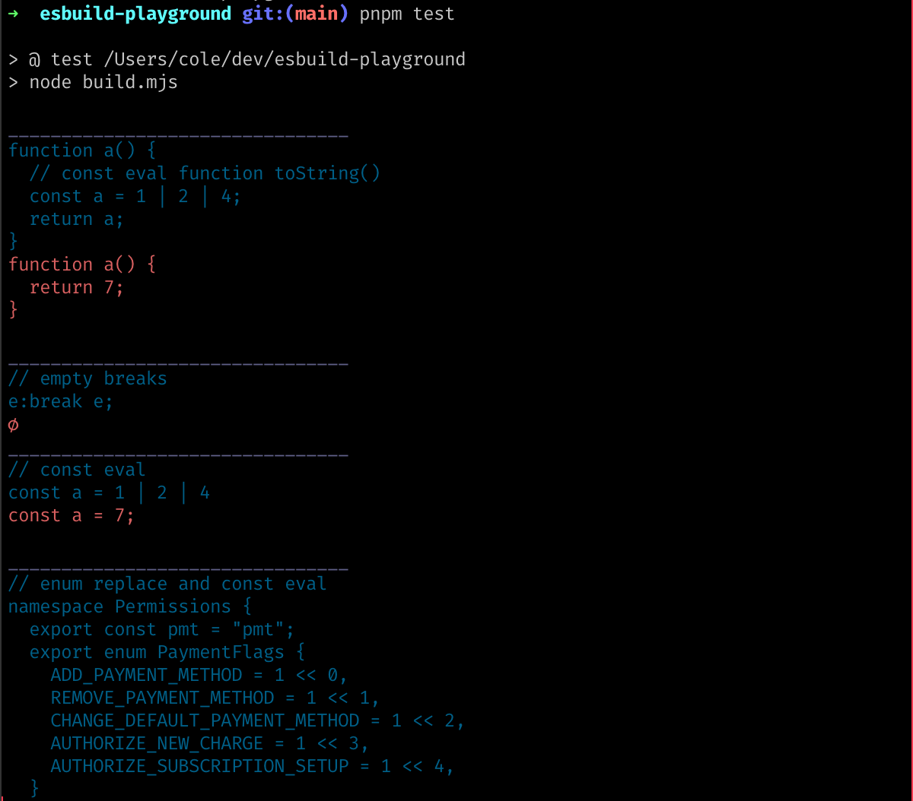

A collection of interesting esbuild minification/mangling tests.

Nowadays, most of my applications have several build.js files which invoke the
esbuild API directly. It's just super easy to use and distribute, and I often
have questions about how it works to optimize my code.
